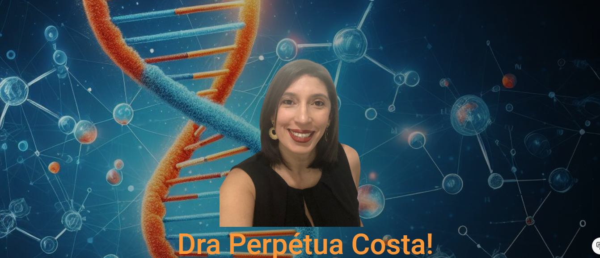

# Portfolio Dra Perpétua Costa
Estágio inicial de um portal eletronico pessoal dedicado
à Genética e à Saúde sob o ponto de vista da docência.

## _Roadmap of Future App Features_ 
 - URL: https://draperpcosta.pro.br
 - Blog.
 - Bate papo
 - podcasts e videos 


## _Table of contents_
- [Portfolio Dra Perpétua Costa](#portfolio-dra-perpétua-costa)
  - [_Roadmap of Future App Features_](#roadmap-of-future-app-features)
  - [_Table of contents_](#table-of-contents)
  - [_Overview_](#overview)
  - [_Screenshot_](#screenshot)
  - [_Links_](#links)
  - [_Built with_](#built-with)
  - [_What I practiced_](#what-i-practiced)
  - [_Continued development_](#continued-development)
    - [_Useful resources_](#useful-resources)
  - [_Author_](#author)
  - [Acknowledgments](#acknowledgments)
## _Overview_
The design is structured as shown:
- src|
  - app |
     - modules |
          -  components |
          -  enum
          -  interface
          -  pages 
  - assets |
  - scss|
    - base
    -  components
    -  layout
    -  theme
  - _index.scss
- index.html
- main.ts
- styles.css 

## _Screenshot_
[](https://draperpcosta.pro.br)
## _Links_
- Live Site URL: [https://draperpcosta.pro.br] 
## _Built with_
[](https://skillicons.dev)

 ## _What I practiced_
``` tsx
import { Routes } from '@angular/router';
import { HomeComponent } from './modules/pages/home/home.component';

export const routes: Routes = [
    {
        path: '',
        component: HomeComponent    
    }
];

``` 
## _Continued development_
- Next step: Keep building the baseline 
### _Useful resources_
- [https://angular.io] Mandatory stop by to really learn the nitty-gritty of Angular.
- [https://material.angular.io/] Material Design components for Angular
- [https://html-css-js.com/] Mandatory pit stop at this site.
## _Author_
- Website - [https://ferreiras.dev.br] 
## Acknowledgments
- @rnhc1000 and God
